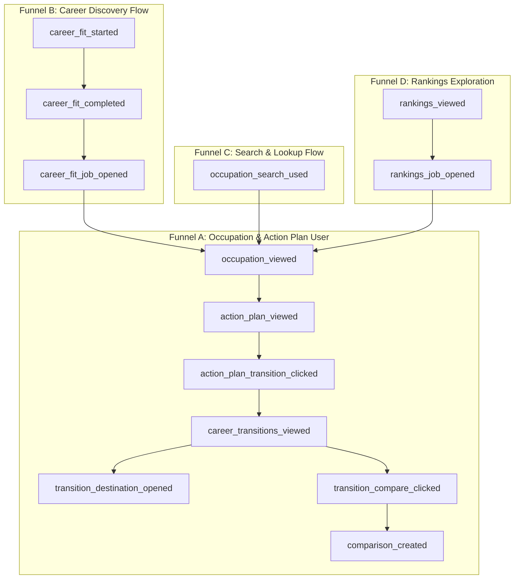

# JobsVsAI — Product Funnel Analytics V1

**Architecture & Measurement Audit Report**  
**Author:** Worker B / Antigravity  
**Branch:** `agent/product-analytics-v1`  
**Status:** **READY FOR ARCHITECT REVIEW**

---

## 1. Executive Summary

JobsVsAI now provides a rich, multi-surface product suite:
- **Occupation Detail** (`/jobs/[slug]`)
- **Occupation Action Plan V1** (Strategic Guidance, Defensible Strengths, AI Adoption, Automation Pressure)
- **Career Transition Explorer V1** (`/jobs/[slug]/transitions`)
- **Career Fit Assessment V1** (`/career-fit`)
- **Career Comparison** (`/compare/[comparison]`)
- **Rankings Explorer** (`/rankings`)
- **Search & Autocomplete** (`/`)

Product Funnel Analytics V1 introduces a centralized, strictly typed, and privacy-preserving measurement infrastructure to understand user journeys, drop-off points, feature adoption, and career transition intent across all published occupations without adding intrusive tracking, third-party cookies, or database write overhead.

---

## 2. Audit of Existing Analytics Infrastructure

| Component | State Found | Resolution in V1 |
| :--- | :--- | :--- |
| **GA4 Setup** | Built-in via Next.js `Script` in `frontend/src/app/layout.tsx` using `NEXT_PUBLIC_GA_MEASUREMENT_ID` with `afterInteractive` strategy. | **Preserved**. No duplicate script tag or alternate analytics framework created. |
| **Environment Guard** | Script is omitted when `NEXT_PUBLIC_GA_MEASUREMENT_ID` is unset (local dev / CI). | **Preserved**. All tracking functions safely no-op during SSR, local testing, and previews. |
| **Helper Module** | Minimal un-typed `frontend/src/lib/analytics.ts` existed with loose `trackEvent`. | **Standardized**. Upgraded into a centralized, strictly typed schema with parameter allowlists and debug logging. |
| **Double-Firing** | Direct `onClick` and component re-renders lacked deduplication across React 19 mount cycles. | **Resolved**. Created `AnalyticsTrackers.tsx` with `useRef` lifecycle deduplication for view events. |
| **Privacy Leaks** | Legacy components occasionally sent search strings or fit scores. | **Audited & Remediated**. Strict allowlists and privacy invariants guarantee zero raw queries, answers, or PII. |

---

## 3. Core Privacy Invariants & Principles

JobsVsAI prioritizes user privacy, zero data hoarding, and compliance with strict privacy standards:

1. **Zero Raw Assessment Answers:** None of the 20 Career Fit questionnaire responses (`answers: { 1: 5, ... }`) are ever serialized, logged, or transmitted.
2. **Zero Profile Vectors or Dimension Scores:** Internal capability/personality vectors (`[0.8, 0.5, ...]`) and dimensional subscores are strictly retained within client state and never sent to telemetry.
3. **Zero Task Text or Guidance Text:** Action Plan tasks and guidance strings are never transmitted in analytics payloads.
4. **Zero Search Term PII:** User search queries are not logged in `occupation_search_used` to prevent inadvertent leakage if a user enters names, emails, or sensitive keywords.
5. **No Fingerprinting or Profiling Cookies:** No persistent identifiers, session replay tools (Hotjar, FullStory, Microsoft Clarity), or third-party tracking cookies are used.
6. **Coarse Categorization Over Exact Precision:** Analytics payloads use coarse risk bands (`low`, `medium`, `high`) rather than floating-point metrics wherever possible.

---

## 4. Standardized Risk Banding Logic

To ensure consistent cross-feature analysis without altering underlying scoring models, all analytics events classify risk into 3 coarse bands:

$$\text{RiskBand} = \begin{cases} \text{"low"} & \text{if } \text{score} \le 40 \\ \text{"medium"} & \text{if } 41 \le \text{score} \le 60 \\ \text{"high"} & \text{if } \text{score} > 60 \end{cases}$$

Helper definition: `getAnalyticsRiskBand(score: number): "low" | "medium" | "high"`.

---

## 5. Central Event Taxonomy & Property Schema

All events are defined in `frontend/src/lib/analytics.ts` via `AnalyticsEventMap` and filtered through a strict runtime allowlist (`ALLOWED_PROPERTIES`):

```typescript
export interface AnalyticsEventMap {
  // ACQUISITION / SEARCH
  occupation_search_used: {
    query_result_count?: number;
    selected_occupation_slug?: string;
  };

  // OCCUPATION DETAIL
  occupation_viewed: {
    occupation_slug: string;
    ai_exposure_band: "low" | "medium" | "high";
    replacement_risk_band: "low" | "medium" | "high";
  };

  // ACTION PLAN
  action_plan_viewed: {
    occupation_slug: string;
    replacement_risk_band: "low" | "medium" | "high";
  };
  action_plan_transition_clicked: {
    occupation_slug: string;
    replacement_risk_band: "low" | "medium" | "high";
  };
  action_plan_career_fit_clicked: {
    occupation_slug: string;
    replacement_risk_band: "low" | "medium" | "high";
  };

  // CAREER TRANSITIONS
  career_transitions_viewed: {
    source_slug: string;
    source_risk_band: "low" | "medium" | "high";
    candidate_count?: number;
  };
  transition_destination_opened: {
    source_slug: string;
    destination_slug: string;
    source_risk_band: "low" | "medium" | "high";
    destination_risk_band?: "low" | "medium" | "high";
  };
  transition_compare_clicked: {
    source_slug: string;
    destination_slug: string;
  };
  transition_career_fit_clicked: {
    source_slug: string;
  };

  // CAREER FIT (Strict Privacy)
  career_fit_started: {
    entry_source?: string;
  };
  career_fit_completed: {
    duration_seconds?: number;
  };
  career_fit_job_opened: {
    destination_slug: string;
    fit_rank?: number;
  };

  // COMPARE
  comparison_created: {
    occupation_a_slug: string;
    occupation_b_slug: string;
  };

  // RANKINGS
  rankings_viewed: {
    sort_by?: string;
    filter_category?: string;
  };
  rankings_job_opened: {
    occupation_slug: string;
    sort_by?: string;
  };
}
```

---

## 6. Primary Product Funnels



### Funnel Descriptions:
1. **Funnel A (Core Retention & Career Planning):** User lands on an occupation $\to$ scrolls to Action Plan $\to$ clicks Transitions CTA $\to$ reviews viable alternatives $\to$ opens alternative career or compares side-by-side.
2. **Funnel B (Discovery & Aptitude Matching):** User starts Career Fit assessment $\to$ completes 20 questions $\to$ receives 12 compatible career recommendations $\to$ clicks a matched career $\to$ enters Funnel A.
3. **Funnel C (Search Entry):** User searches for a profession on the homepage $\to$ views autocomplete matches $\to$ navigates to occupation detail.
4. **Funnel D (Rankings & Market Discovery):** User explores `/rankings` table with sort/filters $\to$ clicks top exposed or resistant job $\to$ enters occupation detail.

---

## 7. Implementation Surfaces & Components

| Surface | File Path | Tracked Events | Mechanism |
| :--- | :--- | :--- | :--- |
| **Occupation Detail** | `frontend/src/components/OccupationDetail.tsx` | `occupation_viewed` | `<OccupationViewTracker />` component with ref guard. |
| **Action Plan Section** | `frontend/src/components/actionPlan/ActionPlanSection.tsx` | `action_plan_viewed`<br>`action_plan_transition_clicked`<br>`action_plan_career_fit_clicked` | `<ActionPlanViewTracker />` on mount + `onClick` handlers on CTAs. |
| **Transitions Explorer** | `frontend/src/components/transitions/TransitionExplorerApp.tsx`<br>`frontend/src/components/transitions/TransitionCard.tsx` | `career_transitions_viewed`<br>`transition_destination_opened`<br>`transition_compare_clicked`<br>`transition_career_fit_clicked` | `<CareerTransitionsViewTracker />` on mount + `onClick` handlers on cards. |
| **Career Fit Assessment** | `frontend/src/components/careerFit/CareerFitApp.tsx`<br>`frontend/src/components/careerFit/CareerMatchCard.tsx` | `career_fit_started`<br>`career_fit_completed`<br>`career_fit_job_opened` | Assessment state transitions (`handleStart`, `handleComplete`) + card clicks. |
| **Career Comparison** | `frontend/src/components/CompareSelector.tsx`<br>`frontend/src/components/CareerComparison.tsx` | `comparison_created` | Form submit handler + `<ComparisonViewTracker />` for direct URLs. |
| **Rankings Explorer** | `frontend/src/components/RankingsExplorer.tsx` | `rankings_viewed`<br>`rankings_job_opened` | `<RankingsViewTracker />` on tab change + `onClick` on table rows. |
| **Search Component** | `frontend/src/components/OccupationSearch.tsx` | `occupation_search_used` | Form submit handler (records result count and selected slug). |

---

## 8. Double-Fire & StrictMode Protection

In React 19 / Next.js Turbopack client components, `useEffect` hooks run on initial mount and during fast refreshes. To prevent phantom duplicate view events:
- All view trackers in `frontend/src/components/analytics/AnalyticsTrackers.tsx` maintain an internal `useRef<string | null>(null)` tracking the last emitted composite key (e.g. `slug`, `${slugA}-vs-${slugB}`, `${sortBy}-${filter}`).
- If the component re-renders or mounts again with the same parameters in the same session, subsequent calls are discarded before reaching `gtag`.
- When the user actively navigates to a new occupation or changes tabs, the key changes, and the new view event fires exactly once.

---

## 9. Development & Testing Support

1. **Debug Mode:** Setting `NEXT_PUBLIC_ANALYTICS_DEBUG="true"` in local development outputs structured, readable console logs:
   ```
   [Analytics] occupation_viewed: { occupation_slug: 'accountant', ai_exposure_band: 'high', replacement_risk_band: 'high' }
   ```
   Debug output only prints properties that have passed the allowlist sanitization.
2. **SSR & Test Isolation:** When `window` is undefined or `window.gtag` is absent, all functions exit immediately without error.
3. **Automated Test Suite:** `frontend/tests/analytics.test.mjs` executes 7 dedicated invariant suites verifying schema allowlists, risk banding, PII prevention, and deduplication.

---

## 10. Verification Results

- **Automated Frontend Test Suite:** **57 passed, 0 failed**
  - Unit & Invariant Tests: `57/57 PASS`
  - Action Plan Invariants: `11/11 PASS`
  - Career Fit Invariants: `13/13 PASS`
  - Career Transitions Invariants: `15/15 PASS`
  - Product Analytics Invariants: `7/7 PASS`
  - AdSlot & Adsense Guard Tests: `11/11 PASS`
- **TypeScript & ESLint:** **0 errors, 0 warnings**
- **Next.js Production Build:** **PASS** (Turbopack, Next.js 16.3.1)
- **Scoring & Backend Invariants:** Untouched (0 backend files modified)

---

## 11. Recommended GA4 Explorations & Custom Reports

Once deployed to production with `NEXT_PUBLIC_GA_MEASUREMENT_ID`, the project owner can build the following standard GA4 Explorations in the Google Analytics Console:

### Exploration 1: Primary Product Conversion Funnel
- **Technique:** Funnel Exploration
- **Steps:**
  1. `occupation_viewed`
  2. `action_plan_viewed`
  3. `action_plan_transition_clicked`
  4. `career_transitions_viewed`
  5. `transition_destination_opened`
- **Breakdown:** `replacement_risk_band` (Answers: *Do high-risk occupations have higher transition CTR than low-risk roles?*)

### Exploration 2: Career Fit Assessment Completion & Conversion
- **Technique:** Funnel Exploration
- **Steps:**
  1. `career_fit_started`
  2. `career_fit_completed`
  3. `career_fit_job_opened`
- **Metrics:** Completion Rate %, Average `duration_seconds`, Destination CTR %

### Exploration 3: Top Explored Transition Destinations
- **Technique:** Free-form Table
- **Dimensions:** `source_slug`, `destination_slug`
- **Metrics:** Event Count for `transition_destination_opened`
- **Filter:** Event name exactly matches `transition_destination_opened`
- **Answers:** *Which alternative careers do users explore most frequently from each profession?*

### Exploration 4: Most Viewed Occupations by Risk Tier
- **Technique:** Free-form Table
- **Dimensions:** `occupation_slug`, `replacement_risk_band`, `ai_exposure_band`
- **Metrics:** Event Count for `occupation_viewed`
- **Answers:** *What occupations drive organic search and user interest?*

---

## 12. Deployment Safety & Status

All changes are committed locally on `agent/product-analytics-v1`. No code has been deployed to production.

**Status:** **READY FOR ARCHITECT REVIEW**
