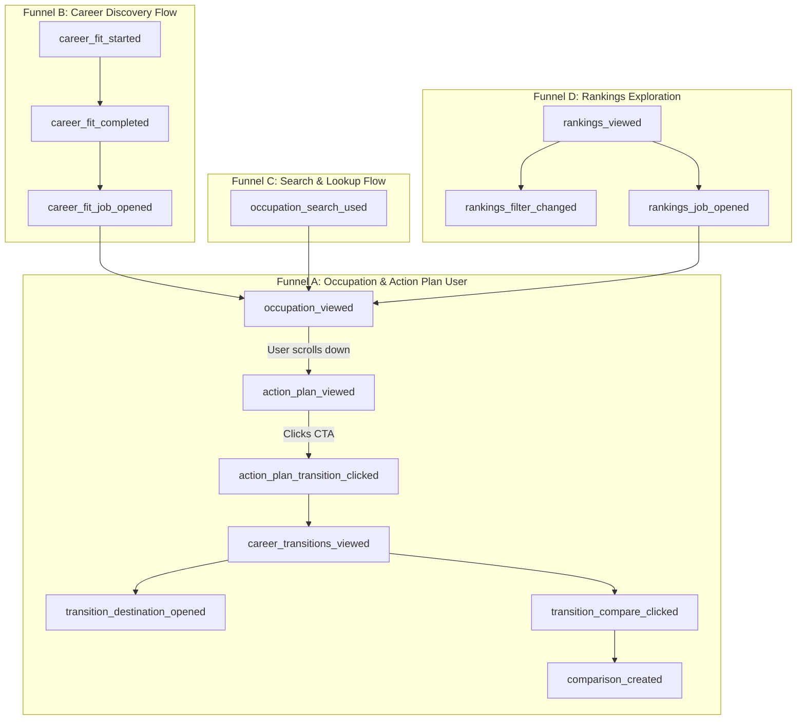

# JobsVsAI — Product Funnel Analytics V1

**Architecture & Measurement Audit Report**  
**Author:** Worker B / Antigravity  
**Branch:** `agent/product-analytics-v1`  
**Status:** **READY FOR PRODUCTION INTEGRATION & DEPLOYMENT**

---

## 1. Executive Summary

JobsVsAI now provides a rich, multi-surface product suite:
- **Occupation Detail** (`/jobs/[slug]`)
- **Occupation Action Plan V1** (Strategic Guidance, Defensible Strengths, AI Adoption, Automation Pressure)
- **Career Transition Explorer V1** (`/jobs/[slug]/transitions`)
- **Career Fit Assessment V1** (`/career-fit`)
- **Career Comparison** (`/compare/[comparison]`)
- **Rankings Explorer** (`/rankings`)
- **Search & Autocomplete** (`/`)

Product Funnel Analytics V1 establishes a centralized, strictly typed, viewport-aware, and privacy-preserving measurement infrastructure. It measures genuine user intent, feature interaction, and funnel progression across the 507 published occupations without adding intrusive tracking, third-party cookies, or database write overhead.

---

## 2. Audit of Existing Analytics Infrastructure & Consent

| Component | State Found | Resolution in V1 |
| :--- | :--- | :--- |
| **GA4 Setup** | Built-in via Next.js `Script` in `frontend/src/app/layout.tsx` using `NEXT_PUBLIC_GA_MEASUREMENT_ID` with `afterInteractive` strategy. | **Preserved**. No duplicate script tag or alternate analytics framework created. |
| **Consent & CMP State** | `afterInteractive` is an execution/performance strategy, **not** an active ePrivacy/GDPR consent gate. GA4 initializes directly when `NEXT_PUBLIC_GA_MEASUREMENT_ID` is set. | **Documented**. The implementation uses standard `window.gtag` calls, ensuring full compatibility with Google Consent Mode (`gtag('consent', ...)`) or a dedicated CMP in future releases. |
| **Environment Guard** | Script is omitted when `NEXT_PUBLIC_GA_MEASUREMENT_ID` is unset (local dev / CI). | **Preserved**. All tracking functions safely no-op during SSR, local testing, and previews. |
| **Helper Module** | Minimal un-typed `frontend/src/lib/analytics.ts` existed with loose `trackEvent`. | **Standardized**. Upgraded into a centralized, strictly typed schema with parameter allowlists, value constraints, and debug logging. |
| **Double-Firing & StrictMode** | Direct `onClick` and component re-renders lacked deduplication across React 19 mount cycles. | **Resolved**. Created `AnalyticsTrackers.tsx` with `useRef` lifecycle deduplication for view events. |

---

## 3. Strict Privacy Invariants & Value Constraints

JobsVsAI enforces strict privacy standards at both the schema and runtime levels:

1. **Zero Raw Assessment Answers:** None of the 20 Career Fit questionnaire responses (`answers: { 1: 5, ... }`) are ever serialized, logged, or transmitted.
2. **Zero Profile Vectors or Dimension Scores:** Internal capability/personality vectors (`[0.8, 0.5, ...]`) and dimensional subscores are strictly retained within client state and never sent to telemetry.
3. **Zero Task Text or Guidance Text:** Action Plan tasks and guidance strings are never transmitted in analytics payloads.
4. **Zero Search Term PII:** User search queries are not logged in `occupation_search_used` to prevent inadvertent leakage if a user enters names, emails, or sensitive keywords.
5. **No Fingerprinting or Profiling Cookies:** No persistent identifiers, session replay tools (Hotjar, FullStory, Microsoft Clarity), or third-party tracking cookies are used.
6. **Property Value Constraints:**
   - **Slugs:** Enforced regex `/^[a-z0-9]+(?:-[a-z0-9]+)*$/`, bounded to $\le 100$ characters.
   - **Risk Bands:** Enum only (`"low" | "medium" | "high"`).
   - **Sort Options:** Known enum only (`"Most exposed" | "Most AI-resistant" | "Highest replacement risk" | "Lowest replacement risk" | "fit" | "risk" | "exposure"`).
   - **Entry Sources:** Known enum only (`"career_fit_page" | "action_plan" | "transitions"`).
   - **Counts / Durations:** Bounded integers (e.g. `query_result_count` $\in [0, 1000]$, `fit_rank` $\in [1, 100]$, `duration_seconds` $\in [0, 86400]$).
   - Any unknown, malformed, or out-of-bounds parameter is discarded prior to dispatch.

---

## 4. Measurement & Viewport Semantics

### A. Action Plan Viewport Observation
- `action_plan_viewed` **does not fire on component mount** when rendered below the fold.
- Uses `IntersectionObserver` observing a sentinel DOM element within `<ActionPlanSection />` with a `threshold: 0.15`.
- Fires **only when the user actually scrolls to and views the Action Plan**.
- Fires exactly once per occupation view. Repeated scrolling in and out does not duplicate the event. Navigating to a new occupation allows a new event to fire.

### B. Single Authoritative Comparison Creation
- `comparison_created` fires authoritatively from `<ComparisonViewTracker />` within `<CareerComparison />` when the comparison is rendered.
- Duplicate submission tracking in `<CompareSelector />` has been removed to prevent double-counting upon form navigation.

### C. Career Fit Lifecycle Semantics
- `career_fit_started` fires only when the user clicks "Begin Career Fit Assessment", not upon landing on `/career-fit`.
- `career_fit_completed` fires exactly once when the 20 questions are completed and results are computed, transmitting only `duration_seconds`.
- `career_fit_job_opened` fires only when the user explicitly clicks a recommended career match card.

### D. Search Semantics
- `occupation_search_used` fires when the user commits a search or chooses an autocomplete match, sending only `query_result_count` and `selected_occupation_slug`.

### E. Rankings Semantics
- `rankings_viewed` fires once upon loading the rankings experience.
- `rankings_filter_changed` fires when the user switches view tabs (`sort_by`) or filters by text.
- `rankings_job_opened` fires when the user clicks to view an occupation from the table.

---

## 5. Central Event Taxonomy & Property Schema

All events are defined in `frontend/src/lib/analytics.ts` via `AnalyticsEventMap`:

```typescript
export interface AnalyticsEventMap {
  // ACQUISITION / SEARCH
  occupation_search_used: {
    query_result_count?: number;
    selected_occupation_slug?: string;
  };

  // OCCUPATION DETAIL
  occupation_viewed: {
    occupation_slug: string;
    ai_exposure_band: "low" | "medium" | "high";
    replacement_risk_band: "low" | "medium" | "high";
  };

  // ACTION PLAN (Viewport-observed)
  action_plan_viewed: {
    occupation_slug: string;
    replacement_risk_band: "low" | "medium" | "high";
  };
  action_plan_transition_clicked: {
    occupation_slug: string;
    replacement_risk_band: "low" | "medium" | "high";
  };
  action_plan_career_fit_clicked: {
    occupation_slug: string;
    replacement_risk_band: "low" | "medium" | "high";
  };

  // CAREER TRANSITIONS
  career_transitions_viewed: {
    source_slug: string;
    source_risk_band: "low" | "medium" | "high";
    candidate_count?: number;
  };
  transition_destination_opened: {
    source_slug: string;
    destination_slug: string;
    source_risk_band: "low" | "medium" | "high";
    destination_risk_band?: "low" | "medium" | "high";
  };
  transition_compare_clicked: {
    source_slug: string;
    destination_slug: string;
  };
  transition_career_fit_clicked: {
    source_slug: string;
  };

  // CAREER FIT (Strict Privacy)
  career_fit_started: {
    entry_source?: "career_fit_page" | "action_plan" | "transitions";
  };
  career_fit_completed: {
    duration_seconds?: number;
  };
  career_fit_job_opened: {
    destination_slug: string;
    fit_rank?: number;
  };

  // COMPARE (Authoritative View)
  comparison_created: {
    occupation_a_slug: string;
    occupation_b_slug: string;
  };

  // RANKINGS
  rankings_viewed: {
    page?: string;
  };
  rankings_filter_changed: {
    sort_by?: "Most exposed" | "Most AI-resistant" | "Highest replacement risk" | "Lowest replacement risk" | "fit" | "risk" | "exposure";
    filter_category?: string;
  };
  rankings_job_opened: {
    occupation_slug: string;
    sort_by?: string;
  };
}
```

---

## 6. Primary Product Funnels



---

## 7. Implementation Surfaces & Components

| Surface | File Path | Tracked Events | Mechanism |
| :--- | :--- | :--- | :--- |
| **Occupation Detail** | `frontend/src/components/OccupationDetail.tsx` | `occupation_viewed` | `<OccupationViewTracker />` component with ref guard. |
| **Action Plan Section** | `frontend/src/components/actionPlan/ActionPlanSection.tsx` | `action_plan_viewed`<br>`action_plan_transition_clicked`<br>`action_plan_career_fit_clicked` | `<ActionPlanViewTracker />` with `IntersectionObserver` + `onClick` handlers on CTAs. |
| **Transitions Explorer** | `frontend/src/components/transitions/TransitionExplorerApp.tsx`<br>`frontend/src/components/transitions/TransitionCard.tsx` | `career_transitions_viewed`<br>`transition_destination_opened`<br>`transition_compare_clicked`<br>`transition_career_fit_clicked` | `<CareerTransitionsViewTracker />` on mount + `onClick` handlers on cards. |
| **Career Fit Assessment** | `frontend/src/components/careerFit/CareerFitApp.tsx`<br>`frontend/src/components/careerFit/CareerMatchCard.tsx` | `career_fit_started`<br>`career_fit_completed`<br>`career_fit_job_opened` | Assessment state transitions (`handleStart`, `handleComplete`) + card clicks. |
| **Career Comparison** | `frontend/src/components/CompareSelector.tsx`<br>`frontend/src/components/CareerComparison.tsx` | `comparison_created` | `<ComparisonViewTracker />` for authoritative rendered comparison view. |
| **Rankings Explorer** | `frontend/src/components/RankingsExplorer.tsx` | `rankings_viewed`<br>`rankings_filter_changed`<br>`rankings_job_opened` | `<RankingsViewTracker />` on mount + `rankings_filter_changed` on tab switch + `onClick` on table rows. |
| **Search Component** | `frontend/src/components/OccupationSearch.tsx` | `occupation_search_used` | Form submit handler (records result count and selected slug). |

---

## 8. Verification Results

- **Automated Frontend Test Suite:** **58 passed, 0 failed** (`frontend/tests/analytics.test.mjs`)
  - Property Allowlist & Strict Value Constraints: `PASS`
  - Career Fit Adversarial Privacy (zero answers, profiles, PII): `PASS`
  - Action Plan Privacy (zero task texts/descriptions): `PASS`
  - Action Plan Viewport Observation Simulation: `PASS`
  - Entity-Scoped Deduplication (route transitions): `PASS`
  - Risk Band Normalization: `PASS`
- **TypeScript & ESLint:** **0 errors, 0 warnings**
- **Next.js Production Build:** **PASS** (Turbopack, Next.js 16.3.1)
- **Scoring & Backend Invariants:** Untouched (0 backend files modified)

---

## 9. Recommended GA4 Explorations & Custom Reports

Once deployed with `NEXT_PUBLIC_GA_MEASUREMENT_ID`, the following standard GA4 Explorations can be configured:

### Exploration 1: Primary Product Conversion Funnel
- **Technique:** Funnel Exploration
- **Steps:**
  1. `occupation_viewed`
  2. `action_plan_viewed` (verified scroll to Action Plan)
  3. `action_plan_transition_clicked`
  4. `career_transitions_viewed`
  5. `transition_destination_opened`
- **Breakdown:** `replacement_risk_band` (Answers: *Do high-risk occupations have higher transition CTR than low-risk roles?*)

### Exploration 2: Career Fit Assessment Completion & Conversion
- **Technique:** Funnel Exploration
- **Steps:**
  1. `career_fit_started`
  2. `career_fit_completed`
  3. `career_fit_job_opened`
- **Metrics:** Completion Rate %, Average `duration_seconds`, Destination CTR %

### Exploration 3: Top Explored Transition Destinations
- **Technique:** Free-form Table
- **Dimensions:** `source_slug`, `destination_slug`
- **Metrics:** Event Count for `transition_destination_opened`
- **Filter:** Event name exactly matches `transition_destination_opened`
- **Answers:** *Which alternative careers do users explore most frequently from each profession?*

### Exploration 4: Most Viewed Occupations by Risk Tier
- **Technique:** Free-form Table
- **Dimensions:** `occupation_slug`, `replacement_risk_band`, `ai_exposure_band`
- **Metrics:** Event Count for `occupation_viewed`
- **Answers:** *What occupations drive organic search and user interest?*

---

## 10. Status & Readiness

All changes are committed locally on `agent/product-analytics-v1`. Ready for cherry-pick and integration onto `main`.

**Status:** **READY FOR PRODUCTION INTEGRATION & DEPLOYMENT**
